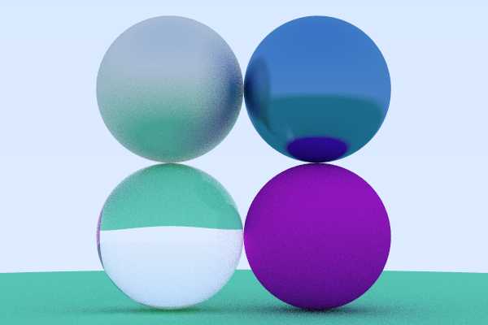

# Spectra

## Rendered image
This is the most recent image rendered.



## Building
To build Spectra, you need CMake and a C++ Compiler, such as g++ or msvc.
```bash
mkdir build
cmake -S src -B build
cmake --build build
```
