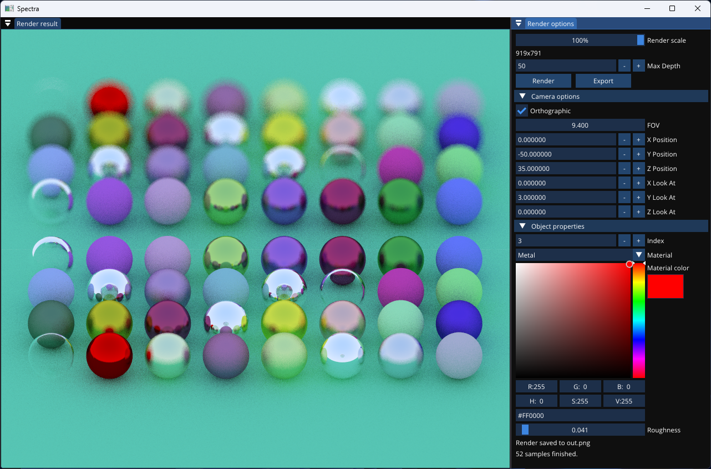

# Spectra

## About
Spectra is a cross-platform ray tracer written in C++ using libraries such as `glm` for vector math, `Dear ImGui` for the GUI and `stb_image` for exporting the result to a `.png` file.

## Rendered image
This is the most recent image rendered. It shows 32 spheres with randomly generated colors and materials, a ground plane and a mirror plane.


## GUI Screenshot


## Features
- Cross-platform
- A Graphical User Interface
- Stochastic Multi-Sampling anti-aliasing
- Materials
- Perspective & Orthographic camera

## Motivation
I've been interested in raytracing for some time, so I decided to try to write one myself.

## Resources I used
- ["An Introduction to Ray Tracing" by Andrew S. Glassner](https://www.realtimerendering.com/raytracing/An-Introduction-to-Ray-Tracing-The-Morgan-Kaufmann-Series-in-Computer-Graphics-.pdf)
- [scratchapixel.com](https://www.scratchapixel.com)
- [pbrt-v3](https://www.pbrt.org)
- [Ray Tracing in One Weekend](https://raytracing.github.io/books/RayTracingInOneWeekend.html)
- [The Cherno's Ray Tracing](https://www.youtube.com/playlist?list=PLlrATfBNZ98edc5GshdBtREv5asFW3yXl)

## Building
To build Spectra, you need CMake 3.2+ and a C++ Compiler, such as g++ or MSVC.
Also, make sure to clone recursively.
```bash
mkdir build
cmake -S src -B build
cmake --build build
```
